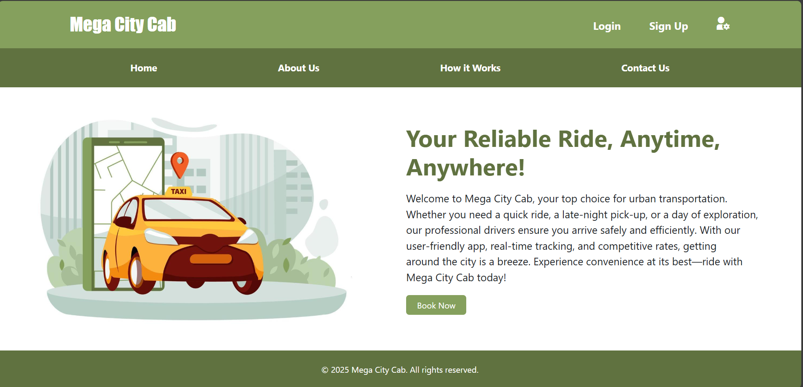
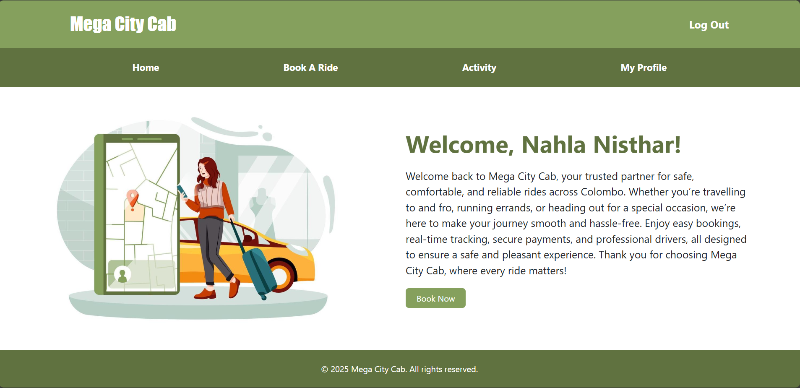
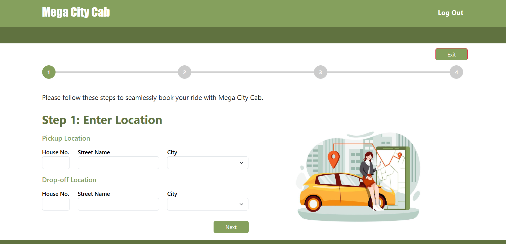
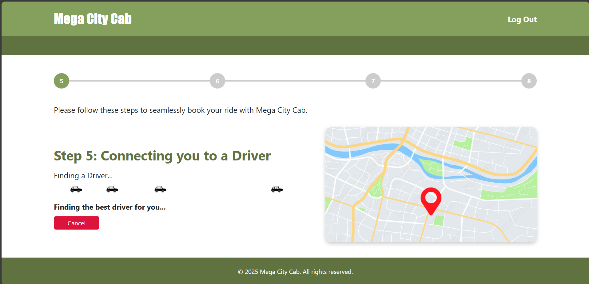
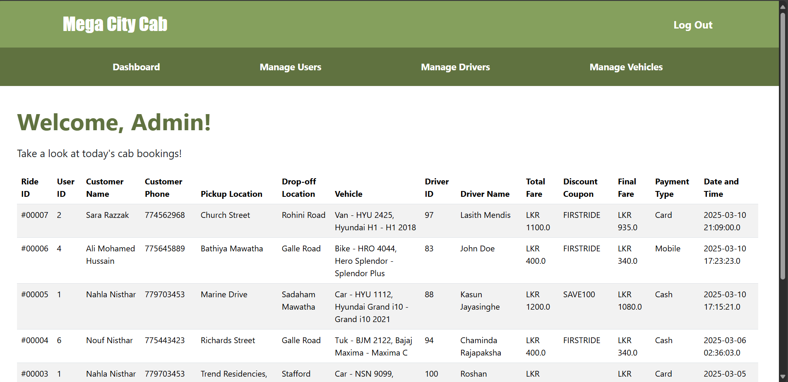

# Mega_City_Cab - Web Application
Mega City Cab is an innovative cab service application for Colombo, designed to streamline ride bookings and management. Key features include secure user login, real-time tracking, and automated fare calculations. This repository contains the source code and documentation for the app, aimed at enhancing urban transportation efficiency.



## Table of Contents
- [Overview](#overview)
- [Features](#features)
- [Versioning Information](#versioning-information)
- [Installation Guide](#installation-guide)
- [Dependencies](#dependencies)
- [CI/CD Workflow](#cicd-workflow)
- [Screenshots](#screenshots)
- [Contribution Guidelines](#contribution-guidelines)
- [License](#license)
- [Contact](#contact)

## Overview
Mega City Cab is a **Java-based web application** designed to streamline the cab booking process. It allows customers to register, book rides, track drivers, make payments, and view ride history. The system also includes an **admin panel** for managing drivers, vehicles, and user activities. 

The project follows **best practices in software engineering**, including:
- **Three-tier architecture** (Presentation, Business Logic, Data Layer)
- **Design patterns** (Singleton, Factory, MVC)
- **Secure session management**
- **Version control with Git/GitHub**
- **Continuous Integration & Deployment (CI/CD)**

## Features
**User Registration & Authentication** (Login, Logout, Session Management)  
**Cab Booking** (Step-by-step booking wizard)  
**Fare Calculation** (Based on pickup & drop-off locations)  
**Real-time Driver Assignment & Tracking**  
**Ride History & Invoice Generation**  
**Admin Dashboard** (Manage users, drivers, and vehicles)  
**Secure Payment Processing** (Cash/Card)  
**User Profile Management**  
**GitHub Version Control & CI/CD Integration**  

## Versioning Information
The application follows **Semantic Versioning (MAJOR.MINOR.PATCH)**:

## Installation Guide
### Prerequisites
Ensure you have the following installed:
- **Java JDK 17+**
- **Apache Tomcat 10+**
- **MySQL 8+**
- **NetBeans IDE / IntelliJ IDEA**
- **Git**

### Technologies Used
- **Java 21.0.5**: Backend development.
- **JDBC & MySQL**: Database connectivity and management.
- **JSP & Servlets**: Dynamic web page rendering and business logic.
- **Tomcat Server version 10**: Web application server.
- **Bootstrap & Tailwind CSS**: Frontend styling and responsiveness.
- **Git & GitHub**: Version control and collaboration.
- **phpMyAdmin**: MySQL database management.

### Setup Instructions
1. **Clone the repository:**  
```sh
 git clone https://github.com/your-username/mega-city-cab.git
 cd mega-city-cab
```

2. **Set up the database:**  
- Import the provided `mega_city_cab.sql` file into MySQL.
- Update `DBconnection.java` with your database credentials.

3. **Configure database connection:**
   - Ensure JDBC URL is set to:
     ```
     jdbc:mysql://localhost:3306/mega_city_cab
     ```
   - Java Database Driver:
     ```java
     Class.forName("com.mysql.cj.jdbc.Driver");
     ```
4. **Open the project in NetBeans.**
5. **Run the application:**  
Deploy the project in Tomcat and access the system via:
```sh
http://localhost:8080/mega-city-cab
```

## Dependencies
- **Servlets & JSP** (Jakarta EE)
- **Bootstrap & Tailwind CSS** (UI Design)
- **JDBC & MySQL Connector** (Database Handling)
- **GitHub Actions** (CI/CD Integration)
- **JUnit & Selenium** (Testing)

## CI/CD Workflow
- **Continuous Integration:** GitHub Actions automatically builds and tests the project.
- **Deployment:** The latest version is deployed on a **local Tomcat server**.
- **Branching Strategy:**
  - `develop` → Development branch
  - `testing` → Code testing & validation
  - `regression` → Pre-production testing
  - `production` → Final deployed version

## Screenshots
Home Page

Registeration

User Dashboard

Ride Booking Wizard

Ride Progressing Wizard

Admin Dashboard


## Contribution Guidelines
Want to contribute? Follow these steps:
1. Fork the repository
2. Create a feature branch: `git checkout -b feature-name`
3. Commit your changes: `git commit -m "Added new feature"`
4. Push to the branch: `git push origin feature-name`
5. Create a pull request

## License
This project is licensed under an open-source license (TBD).

## Contact
For any queries, contact **nahla.nisthar@gmail.com**.


